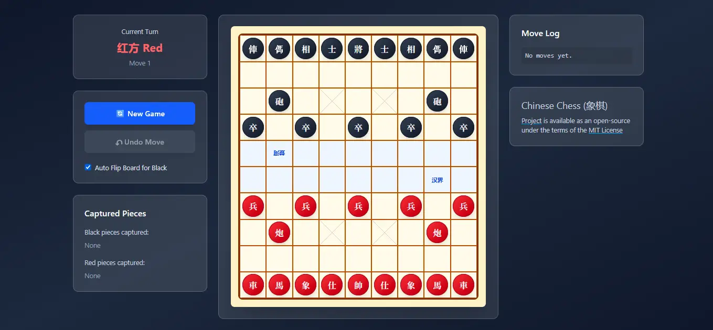

# [Chinese Chess (XiangQi)](https://thexiangqi.vercel.app)

A web-based implementation of Chinese Chess (XiangQi) built with Vue. Play against a friend locally, view move history, and enjoy a responsive, mobile-friendly interface.

## Features

- Move validation for all pieces according to XiangQi rules
- Move log with step-by-step history
- Undo last move
- Captured pieces display
- Board auto-flips for black's turn (toggleable)
- Responsive design for desktop and mobile

## Demo

Play online: [thexiangqi.vercel.app](https://thexiangqi.vercel.app)

## License

This project is licensed under the [MIT License](LICENSE).

